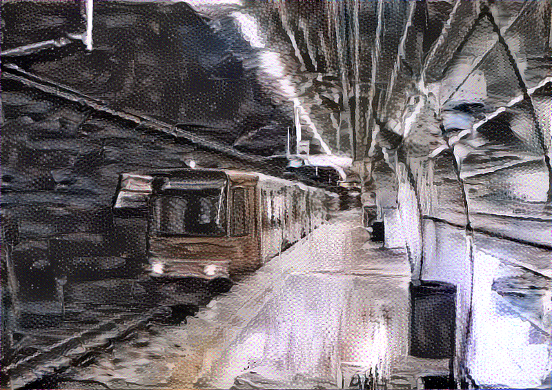

# Neural Style Transfer with 19-layer VGG-Network

**Goal**: Generate a new image G from a base image B with styles from a style image S.

**References**:
+ Neural Style Transfer: [Gatys et al. (2015)](https://arxiv.org/abs/1508.06576)
+ deeplearning ai: [Neural Style Transfer](https://www.coursera.org/lecture/convolutional-neural-networks/what-is-neural-style-transfer-SA5H8)
+ 19-layer VGG network: [Simonyan, Zisserman (2015)](https://arxiv.org/abs/1409.1556)
+ pretrained networks: [MathConvNet](http://www.vlfeat.org/matconvnet/pretrained/)
+ ConvNet visualization: [Zeiler, Ferges (2013)](https://arxiv.org/abs/1311.2901)

## Result

